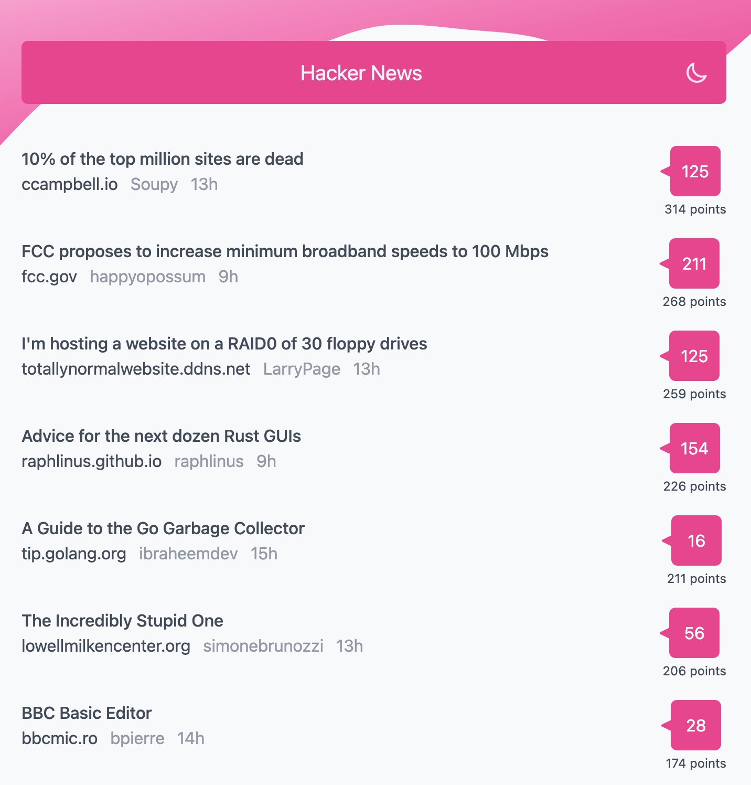

# hacker-news

[](https://github.com/coocos/hacker-news/actions/workflows/tests.yaml)

React frontend for [Hacker News](https://news.ycombinator.com/) built on top of [Algolia HN API](https://hn.algolia.com/api). You can access it [here](https://hn.lamsa.dev).

## Screenshot



## Usage

### Development

To start the development server:

```
npm run dev
```

### Production build

To build a deployable bundle:

```
npm run build
```

### Running tests

To run a basic set of tests with jest:

```
npm test
```
